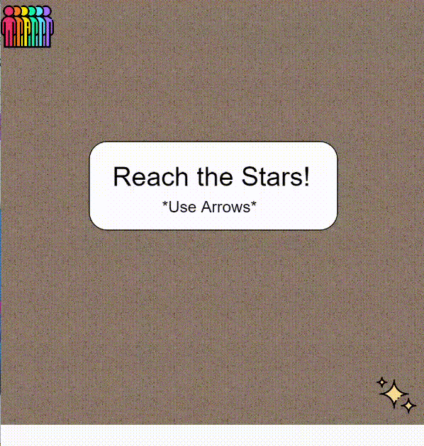

## reach the stars game



## p5js library

That's the first game I developed in javascript using the p5js.org library.
P5js is a JavaScript library for creative coding, with a focus on making coding accessible and inclusive for all.
I also used css and html for the visual parts.

## the start

first of all, I created the canvas where the game happens and uploaded the images I needed for the game to work.

```
//setup
function setup() {
  createCanvas(480, 480);
  personagem = loadImage('people.png');
  star = loadImage('star.png');
  floor = loadImage('floor.png');
  hand = loadImage('hand.png');
}
```

## the visuals

then, I had to draw all the elements that will appear on the game, and also locate them on the canvas.

```
//background
  for(let i = 0; i < 8; i++){
    for(let j = 0; j < 8; j++){
      image(floor, tamanho * i, tamanho * j, tamanho, tamanho);
    }
  }

//icons
  image(star, 424, 424, 45, 45);
  image(personagem, andarX, andarY, tamanho, tamanho);
```

## the movements

for the movement to work, I had to create a function that tells the keybord what happens when a key is pressed.
also, I created constraints for the movements, so the icon didn't disappear when it crosses the canvas limit.

```
//constraints
  if(andarX > tamanho*7){
    andarX = tamanho*7
  }
  if(andarY > tamanho*7){
    andarY = tamanho*7
  }

//keyPressed
function keyPressed() {
  if(keyIsDown(UP_ARROW)){
    andarY -= velocidade
  }
  
  if(keyIsDown(DOWN_ARROW)){
    andarY += velocidade
  }
  
  if(keyIsDown(LEFT_ARROW)){
    andarX -= velocidade
  }
  
  if(keyIsDown(RIGHT_ARROW)){
    andarX += velocidade
  }
}

```

## the end

after you play it a little, you find that the end is when you ✨ reach the stars ✨, so I created a message that congratulates you for getting there, and tells you won.

```
//end
if (andarX === tamanho*7 && andarY === tamanho*7) {
    rect(120, 160, 240, 160, 20);
    textSize(30);
    text('You Won!', 178, 230);
    textSize(28);
    text('Congratulations!', 144, 270);
    image(hand, 180, 280, 120, 120);
    
    restart = createButton('Restart');
    restart.mousePressed(resetar);
    noLoop();
}
```

## here we go again?

In case you`d like to restart the game, I created a reset function that is activated when you click the restart button, wich appears right when the game ends, and takes you back to the start of the game.

```
//reset 
function resetar(){
  andarX = 0;
  andarY = 0;
  restart.remove();
  loop();
}
```

## closing

It was a fun experience creating a game from zero, speacially when I've never had any contact with codes or development. 
The p5js gives you a good look of what it is and what it takes to make a code work, and it's easy to use. 
If you want to try it out, or play the game, you can do that on the following link.

[reach the stars](https://editor.p5js.org/jwandrey/full/nJ-av2jVK) play it here!